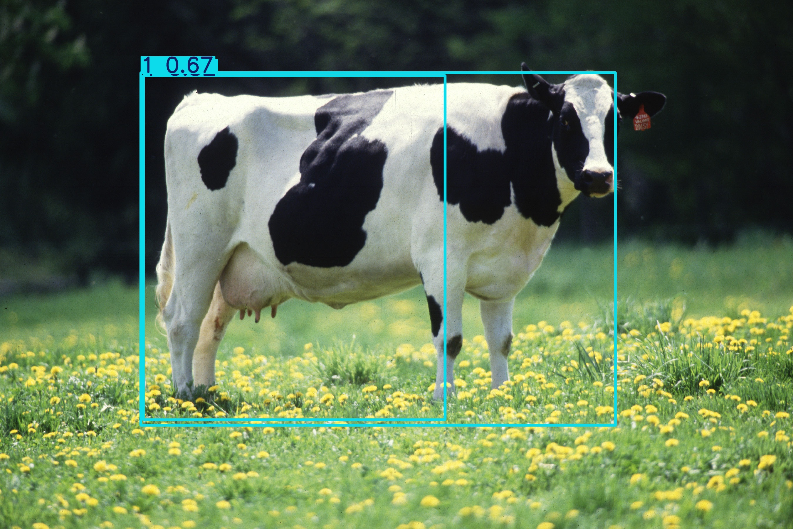
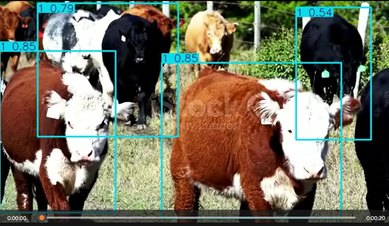

# Livestock Detection System (YOLOv8)

## Project Overview
This repository contains a computer vision pipeline designed for **automated livestock monitoring** in agricultural environments. By leveraging state-of-the-art object detection architectures, this system identifies cattle in both static imagery and real-time video feeds.

The solution addresses key challenges in Precision Livestock Farming (PLF), providing a lightweight inference engine suitable for edge deployment (e.g., drones, barn cameras) to assist with automated headcounts and health monitoring.

## Technical Architecture

### 1. Model Selection: YOLOv8-Nano
The **YOLOv8n (Nano)** architecture was selected to prioritize **inference latency** suitable for real-time applications.
* **Edge-Ready:** With approximately 3.2M parameters, this model is optimized for deployment on resource-constrained hardware without significant compromises in mean Average Precision (mAP).
* **Scale Invariance:** The architecture utilizes an anchor-free detection head and a CSPDarknet backbone, improving detection performance on objects at varying distances (e.g., distant grazing vs. close-up).

### 2. Training Strategy (Transfer Learning)
* **Dataset:** Sourced via Roboflow (Annotated Livestock Dataset).
* **Optimization:** Fine-tuned pre-trained COCO weights for 15 epochs to adapt feature extraction layers specifically for cattle features.
* **Environment:** Trained on NVIDIA Tesla T4 GPU.

## Inference Results
The model is capable of processing both individual images and video streams. Below are examples of the model's performance on unseen test data.

### Static Image Test
Successfully detected livestock with high confidence in a static environment.


### Video Stream Test (Snapshot)
Real-time detection applied to video footage. The system maintains consistent tracking across frames.


## Repository Structure
```text
.
├── src/
│   ├── Livestock_Detection_Training.ipynb  # Training pipeline (ETL + Training Loop)
│   └── track_livestock.py                  # Video inference script for production use
├── best.pt                                 # Fine-tuned YOLOv8 weights
├── requirements.txt                        # Dependency manifest
├── result_image.jpg                        # Proof of concept (Image)
├── result_video_frame.jpg                  # Proof of concept (Video Frame)
└── README.md                               # Project documentation

## Installation & Usage

### Prerequisites
* Python 3.8+
* `pip` package manager

### Setup
1.  **Clone the repository:**
    ```bash
    git clone https://github.com/MenesesCarlos29/livestock-detection-yolo.git
    cd livestock-detection-yolo
    ```

2.  **Install dependencies:**
    ```bash
    pip install -r requirements.txt
    ```

### Execution
To run inference on a new video file:

1.  Place your video file (e.g., `input.mp4`) in the project root.
2.  Edit `src/track_livestock.py` to point to your video filename (or run via CLI if configured).
3.  Run the script:
    ```bash
    python src/track_livestock.py
    ```

## Repository Structure
* `src/`: Source code for training (Jupyter Notebook) and inference (Python script).
* `best.pt`: Serialized PyTorch model weights (Fine-tuned).
* `requirements.txt`: Python dependencies.

---
*AgTech Computer Vision Portfolio Project.*